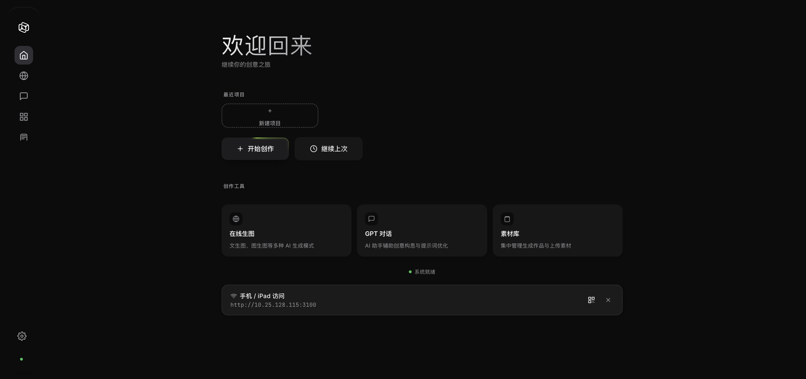
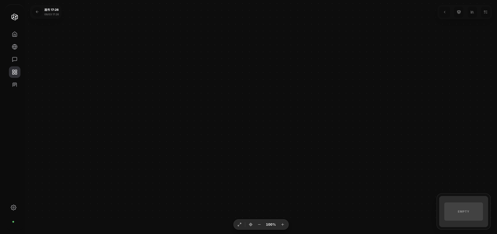
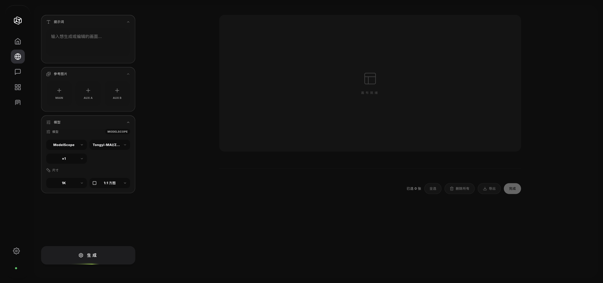
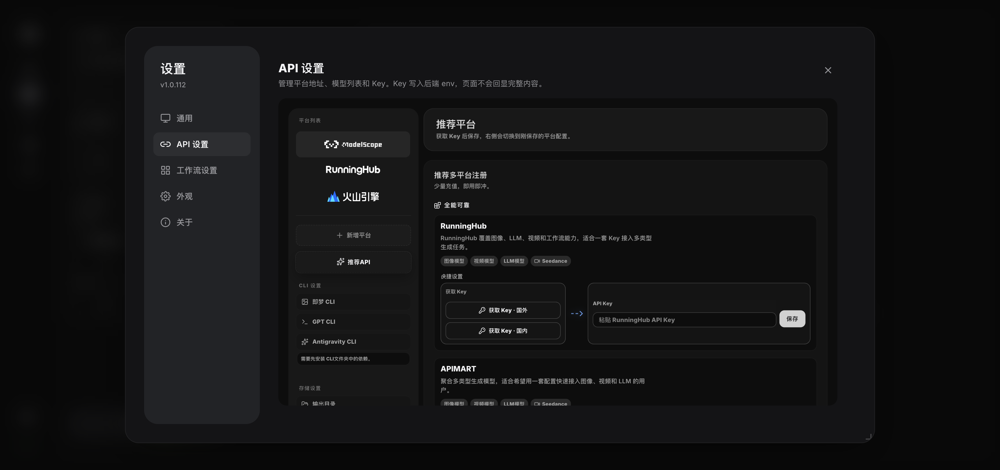
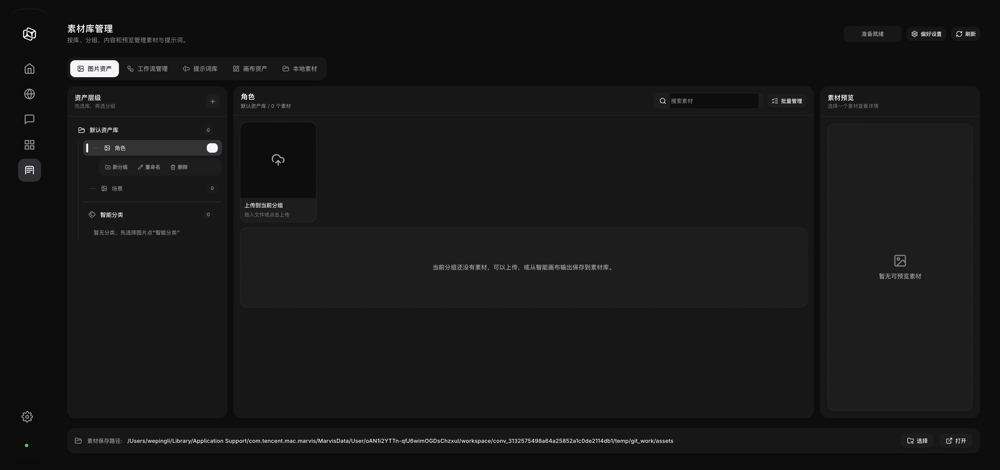

# MGStudio · Infinite Canvas AI Creation Platform

> Freely generate images and videos on an infinite canvas, connecting workflows with nodes. Built-in free ModelScope API, ready to use out of the box.
>
> **[中文](README.md) · [Website](https://maoge19523-cpu.github.io/MGCanvas2.0/) · [Docs](https://maoge19523-cpu.github.io/MGCanvas2.0/docs.html)**

MGStudio is an all-in-one AI workbench for creators. On an **infinite canvas** you can drag, connect, and combine various AI capabilities — text-to-image, image-to-image, AI video generation, GPT multimodal chat — all seamlessly in one interface. The canvas **AI assistant is a real Agent**: state a goal in one sentence and it plans and acts on its own — creating nodes, wiring them up, running generations, checking tasks — with every step visible and the whole run rollbackable. Paired with **Photoshop panels** and **Chrome extensions**, asset collection and creative workflows flow together.











---

## Quick Start

### Download & Install (Recommended)

No Python installation or environment configuration needed — download the installer and run.

#### Windows

1. Grab `MGStudio-Setup-<version>.exe` from [Releases](https://github.com/maoge19523-cpu/MGCanvas2.0/releases)
2. Double-click to install and follow the wizard (desktop shortcut auto-created)
3. Launch the "MGStudio" icon on your desktop, browser opens `http://127.0.0.1:3000/` automatically

#### macOS

1. Grab `MGStudio-Setup-<version>.dmg` from [Releases](https://github.com/maoge19523-cpu/MGCanvas2.0/releases)
2. Open the DMG and drag `MGStudio.app` into the `Applications` folder
3. Double-click `MGStudio.app` to launch, browser opens `http://127.0.0.1:3000/` automatically

> Want the desktop client with a bundled Chromium engine and one-click auto-update? Use the Electron build: `MGStudio-Electron-Setup-<version>.exe` on Windows, `MGStudio-<version>-arm64.dmg` on macOS. Both **share the same data directory** as the build above, so you can switch at any time — see "Desktop Client" below.

> **First launch note**: macOS may warn "cannot be opened because it is from an unidentified developer". Go to **System Settings → Privacy & Security → click "Open Anyway"**.

---

### Manual Install (Developers)

If you want to run from source or contribute:

```bash
# Clone the repository
git clone https://github.com/maoge19523-cpu/MGCanvas2.0.git
cd MGCanvas2.0

# Install dependencies
pip install -r requirements.txt

# Start the server
python main.py
```

Open `http://127.0.0.1:3000/` in your browser.

> Requirements: Python 3.10+

---

## FAQ

### Windows

| Issue | Solution |
|-------|----------|
| **Cannot open after install** | Check firewall settings; try running as administrator |
| **Port 3000 in use** | Close the program using the port, or set env var `DEPLOY_RUN_PORT=3001` before starting |
| **Dependency install fails** | Ensure Python 3.10+ is installed with "Add Python to PATH" checked |
| **Antivirus false positive** | Add the MGStudio installation directory to antivirus whitelist |

### macOS

| Issue | Solution |
|-------|----------|
| **"Unidentified developer" warning** | Go to **System Settings → Privacy & Security → click "Open Anyway"** |
| **"App is damaged" warning** | Run in terminal: `sudo xattr -rd com.apple.quarantine /Applications/MGStudio.app` |
| **Port 3000 in use** | Run `lsof -i :3000` to find the process, `kill <PID>` to end it; or set `DEPLOY_RUN_PORT=3001` |
| **Dependency issues (manual install)** | Ensure Python 3.10+: `python3 --version`, then `pip3 install -r requirements.txt` |

---

## AI Models

Built-in **ModelScope** free API, ready out of the box:

| Type | Model | Description |
|------|-------|-------------|
| Chat | Qwen3-235B | Tongyi Qianwen flagship, reasoning/writing |
| Chat | Qwen3-VL-235B | Multimodal, image analysis |
| Image | Qwen-Image-2512 | Best Chinese text rendering, posters/banners |
| Image | FLUX.2-klein-9B | Best visual quality |
| Image | Z-Image-Turbo | 1-2s fast generation |
| Image | Qwen-Image-Edit-2511 | Edit images by talking |
| Video | agnes-video-v2.0 | Free video generation |

Beyond the built-in free quota, "API Settings → Add platform" connects platforms from your own accounts. Model names are kept per platform and never swapped between them:

| Protocol | Platforms |
|----------|-----------|
| OpenAI-compatible | Relays / official-compatible endpoints (gpt-image, Nano Banana, …); presets: Lingjing API, Agnes AI, EXELLOME, FHL, VIP-GPT |
| Async protocol | APIMart |
| Native Gemini | Google Gemini (images via `/v1beta`) |
| Ark | Volcengine (Doubao Seedream images, Seedance video) |
| RunningHub | OpenAPI workflows |
| CLI | Jimeng CLI, OpenAI Codex CLI, Antigravity CLI |
| Design agent | Lovart (Access Key / Secret Key signing) |

Provider dropdowns only list platforms **with a configured key**; platforms without one never appear in generation nodes and are never chosen as the default.

---

## Key Features

- 🧠 **Smart Canvas AI assistant (real Agent)** — state a goal in one sentence and the model plans and acts over multiple rounds (create nodes, wire them up, run generations, check tasks); every step streams live and the whole run can be rolled back
- 📊 **Table-driven batch production** — one table drives batch image/video generation: per-row assets and prompts, real per-row progress, stop anytime, and a single result node per batch
- 🎭 **Lovart design agent** — connect with an Access Key / Secret Key for image and video generation, asset upload and result download
- 💬 **Chat-style creation** — LLM nodes and GPT chat support multi-turn context, selectable personas (default "Prompt Optimizer") and a live thinking process
- 🎨 **Infinite Canvas** — free zoom, drag, and connect for creation
- ⚡ **Node Workflows** — image/video/LLM nodes connected in chains
- 🤖 **Auto-Place on Canvas** — AI results auto-create nodes, no manual import
- 💡 **Smart Suggestion Bar** — auto-popup "change outfit / change scene / add camera move" one-click continuation
- 🔍 **@ Reference** — type @ in the input box to reference canvas nodes as source material
- 👤 **Face Blur** — one-click blur all faces in a video to protect the privacy of people in the frame (YuNet detection)
- 🔌 **Plugin System** — Photoshop panels, Chrome extensions
- 🌐 **Multi-Repo Updates** — GitHub / Gitee / ModelScope three sources
- 🇨🇳 **Chinese Optimized** — deep Qwen ecosystem integration

---

## Responsible Use & Content Compliance

Please use MGStudio responsibly and in compliance with applicable laws and platform content-safety policies. When working with footage that contains recognizable people, ensure you have the necessary rights or consent, and avoid using any media that infringes on others' personal rights or privacy.

> **Privacy tip**: If your reference footage contains bystanders or people who have not given consent, use the built-in **Face Blur** tool (Smart Canvas → select the video node → toolbar "Face Blur") to protect their identity before using the material.

---

## Download & Updates

Installers and update sources:

| Platform | URL |
|----------|-----|
| GitHub | https://github.com/maoge19523-cpu/MGCanvas2.0 |
| Gitee | https://github.com/maoge19523-cpu/MGCanvas2.0 |
| ModelScope | https://github.com/maoge19523-cpu/MGCanvas2.0 |

The app checks all three sources for the latest version on startup, pushes update notifications, and upgrades with one click (ModelScope installers live under `electron-release/` in that repo — the same source the app uses for mirror updates).

---

## Desktop Client (Electron · Beta)

> New packaging route: **Electron** with its own Chromium engine (consistent behavior across platforms, no more system WebView differences), with electron-updater auto-update.

- Source & build docs: **desktop/README.md**
- Reuses the existing frontend through a pywebview compatibility bridge (window.pywebview.api) — native dialogs / window controls / system tray with zero frontend changes
- **Fully shares data with the official build**: same port 3000 and same data directory (Windows `%APPDATA%/MGStudio`, macOS `~/MGStudio`) — canvases, settings and chat history are shared, **no data re-download or migration needed, just install and run**; if the official build is already running, the Electron app reuses its backend instead of starting a second one
- **Three-repo update channel**: GitHub Releases as the primary source; if the check fails (common on Chinese networks) it automatically falls back to a ModelScope mirror (`maoge19523-cpu/MGCanvas2.0`), with Gitee Releases as a manual-download backup. The cloud pipeline (triggered by pushing a `v*` tag) syncs installers to all three repos automatically
- **Auto-restart after update**: on Windows the update installs and restarts automatically after user confirmation; on macOS, unsigned builds cannot auto-install (Squirrel requires code signing), so the app falls back to a guided manual download — data is never affected

---

## Changelog

### v1.0.123

- **New floating toolbar on Smart Canvas image nodes**: portrait & emotion adjustment, panorama, multi-angle, relighting, nine-grid templates, crop (HD / outpainting / redraw / erase / cutout / crop), element editing, layer separation, grid split, annotation, rotate, download and preview — all from one entry point
- **New "HD Upscale"**: free offline local AI upscaling to 2K / 4K; images already close to the target resolution fall back to high-quality resampling instead of forcing the AI model (about 50MB of components download on first use)
- **PSD export with real layers**: a single image is split into subject + background automatically, multiple images become one layer each, and text can be layered automatically
- **Reference videos turn into storyboard tables automatically**: works on both the classic canvas and the Smart Canvas — set "seconds per shot" (1–5, default 3) and the video is cut into one row per shot, with each row using only its own clip as the video reference
- **Canvas Agent plan mode and a rebuilt LLM console**: the Agent now presents a plan card and its impact first and only runs after you confirm, keeps a run history and matches image / video providers to the model you picked; LLM nodes and the prompt console stream as they generate, can be cancelled or retried, abort automatically when no text arrives for a long time, support @-referencing upstream assets, and use unified dropdowns for provider / model / output form
- **Upgraded image and video node parameters**: image generation adds a Background option (auto / keep / transparent), and sizes can be picked from presets, entered manually or matched to the input image's aspect ratio; video nodes add count, aspect ratio, resolution, a sound toggle and a "More parameters" panel, with a status label and elapsed time while generating
- **Consistent UI and a slimmer installer**: outlines and hairlines are gone across the app, popovers use frosted glass, every select caret is the same linear chevron and selection uses a soft tint; the HD upscale runtime and the cutout model are no longer bundled and download on first use instead
- **Fixes**: saving or downloading no longer opens several system dialogs from a single click; JSON containing real newlines from a model no longer breaks table parsing; macOS HD upscale components are made executable after extraction, so no more "Permission denied"

### v1.0.122

- **Fix**: Lovart was missing from existing installs — the platform list only received it when it was empty (fresh installs). After upgrading it shows up directly in API Settings; fill in an Access Key / Secret Key to use it. A platform without keys never appears in generation node dropdowns
- **Improvement**: an auto-added platform can no longer take over your default — a provider without configured keys is no longer picked as the primary provider

### v1.0.121

- **The Smart Canvas AI assistant is now a real Agent**: give it one instruction and the model plans and executes multiple rounds by itself (create nodes, wire connections, run generations, check tasks); every step streams live, canvas edits appear immediately, and the whole run can be rolled back
- **New Lovart design-agent provider**: image / video generation, asset upload and result download, connected with an Access Key / Secret Key
- **Chat mode on LLM nodes**: multi-turn context, selectable personas (default "Prompt Optimizer"), a live thinking process (stopwatch + breathing animation), and a draggable input height that is remembered
- **Unified motion**: dropdowns and select lists use a Glide highlight pill, buttons give state feedback (MorphButton), light/dark aware; API Settings and ComfyUI workflow settings rebuilt to one design language
- **Model selection fixes**: models you picked in canvas settings are no longer cleared or replaced by the first list entry, providers without keys no longer appear in dropdowns; a stale model left on a node after switching platforms is normalized to that platform's remembered model with a visible hint
- **Table / batch generation fixes**: each row references only its own assets, `@图片N` placeholders resolve against the global index, one batch run produces a single result node, groups containing each other no longer hang, and the mouse wheel inside tables no longer zooms the canvas

### v1.0.120

- **Fix: the Electron desktop backend failed to start** — the shell passed `--port` while the backend only accepted a positional argument, so it crashed on launch ("backend failed to load"); it now accepts `--port` / positional / env var, the first-launch wait is extended to 3 minutes, and a startup failure shows the backend log in a dialog
- **Update pipeline fixes**: `prompt_intelligence.py` added to mirror sync / one-click update / packaged resources; the fallback source order now prefers the domestic mirror and deprioritizes known-stale sources; Gitee split-volume sync recognizes the new Electron installer name
- **UI**: the top title area was rebuilt to native macOS specs (traffic lights back in place, 28px bar); side padding unified to 24px across 9 content pages

### v1.0.119

- **Update UI revamp**: the "one-click update" dialog follows the project design language (light/dark aware); when a new version is found a persistent reminder appears in the bottom-right — update now or dismiss it (the same version won't nag again, a newer one will)
- **Fix**: the ModelScope connectivity check in the update dialog pointed at a long-retired address; it now uses the `maoge19523-cpu/MGCanvas2.0` model repo

### v1.0.118

- **Windows auto-update fix**: the installer name didn't match `latest.yml` (404 downloads / checksum failures) — Electron installers are now named `MGStudio-Electron-Setup-<version>.exe`; also fixed mirror sync overwriting each other across platforms, which had left some platform update files missing

### v1.0.117

- **Fix: in-app updates on Chinese networks**: the domestic fallback pointed at a ModelScope studio page that only returns HTML (no update files); it now uses the ModelScope model-repo mirror. Unsigned macOS builds no longer attempt auto-install and instead guide a manual download

### v1.0.116

- **Lingjing API video routing**: Hailuo MiniMax, Kling, Vidu, Tongyi Wanxiang, Doubao Seedance, Luma, Runway and a generic unified format, routed automatically by model-name prefix
- **Lingjing API protocol inference**: Gemini image models automatically use the native `/v1beta` protocol while the rest stay OpenAI-compatible — no more per-model protocol setup; model fetching also fills in Gemini models hidden by token-group filtering
- **Agnes AI Video 2.5 / 2.5 Flash** video models (OpenAI Videos compatible protocol)
- **Protocol tables** gained text/image/video entries for Lingjing and Agnes; `/api/ai/descriptor` now understands the video intent for both
- **Fix**: `gpt-image-1 / 1.5` failed on some relays (the request carried the removed top-level `response_format`); it is no longer sent, and retried once without it when the upstream rejects it
- **Improvement**: generated images show their real pixel size (e.g. `gpt-image-2 · 1254×1254`) so downscaled output isn't mistaken for 2K/4K
- **Fix**: the GPT chat model picker only lists configured platforms (enabled + key + models); built-in ModelScope default chat models are retired and cleaned out of existing configs
- **Fix**: GPT chat could not be scrolled back while streaming (it now follows only when already at the bottom); the header lost its visible border and block

### v1.0.115

- **Pro color grading for image nodes**: a new Adjust mode in the image editor — glfx (WebGL) real-time filters with 5 parameter groups (light / color / curve / detail / effect) plus a draggable RGB curve, and a drag divider to compare against the original; applying creates a new image node and keeps the original
- **Group layout rebuilt**: members fill a grid sized by the group's largest original aspect ratio (full width, slack centered vertically) and reflow live while you resize the group; groups now support custom names (Enter to commit / Esc to revert)
- **One-click group run**: "Run group" on the classic canvas and "Run all" on the smart canvas execute members in order
- **Canvas assistant redesigned**: now follows Spectrum's "AI Chat Card" — the empty state types sample prompts into the composer (click to take over), sunken composer, round attach/send buttons, one-click reset
- **Connection ports rebuilt**: white outlined plus-in-circle that thickens and scales on hover/select; fixes ports being invisible in dark theme and disappearing when hovered
- **Fix**: smart canvas `#world` was positioned relative, shifting coordinate math so nodes rendered in the wrong place or not at all
- **Fix**: smart canvas image preview's **compare with original** entry point was never visible — the button was set to `display:none` by earlier logic and nothing restored it; visibility is now owned by the preview panel (hidden for video / 360 panorama, shown for images, greyed out when there is no upstream to compare)
- **Fix (important)**: historical assets missing after upgrading on Windows — the asset directory was mis-resolved because the installer ships bundled assets into the install folder, silently switching existing users there so every historical image 404'd; existing users now always keep their data directory, and `/assets` falls back to the other folder so assets on either side stay visible

### v1.0.114

- **Historical asset fix**: fixed missing historical images after macOS upgrades — the asset directory was wrongly resolved to a read-only folder inside the app bundle; it now falls back to the real data directory (`~/MGStudio/assets`), restoring canvases and local assets

### v1.0.113

- **Install & launch fix**: fixed installers failing to start — cloud builds were missing the server backend module, causing `No module named 'server'`; the server router module is now included in the repo and rebuilt into the packages, restoring the asset library / local assets / prompt library APIs

### v1.0.112

- **Unified visual refresh**: design tokens converged across 11 feature pages (marvis-shared/theme), unifying colors, spacing, radius and typography
- **GPT chat revamp**: header / input / empty state / model picker (V17-V19) redesigned
- **Configurable thinking effort**: pushed from backend, read directly by frontend
- **Fixes**: explicit size selection no longer overridden by prompt keywords (stable gpt-image-2 resolutions); gemini color-cast rollback and other backend fixes
- **Other**: beam lighting visual effects, centralized frontend icons (shared/icons.js)

### v1.0.112-beta.1 (Beta)

- **Electron desktop client**: bundled Chromium engine; shares port 3000 + the same data directory with the official build (full data interop); tray / native dialogs / window controls
- **Live update progress bar**: per-stage percentage (download / verify / backup / replace) + current file name, with toast notifications for update results
- **Three-repo update channel**: GitHub primary, automatic ModelScope mirror fallback for Chinese networks, Gitee manual-download backup
- **Desktop sidebar flicker fix**: hover-expand no longer toggles rapidly under Chromium

### v1.0.111

- **Local high-quality cutout**: image nodes get "High-Quality Cutout" — RMBG-2.0 local model downloads on demand (349MB, first use only), then offline & free; edge refinement (alpha stretch + erode/feather + background-color decontamination); one-click fallback to online cutout
- **Windows title bar drag fix**: frameless window title bar is draggable again
- **Old model cleanup**: leftover RMBG-1.4 model is removed automatically after upgrade

### v1.0.108

- **Port fix**: restored official port 3000 (accidental test-build 3001 push corrected)
- **Model whitelist**: assets/models/ added to online-update whitelist, face-detection model ships with updates

### v1.0.107

- **Face Blur tool**: select video node → one-click blur all faces in toolbar for better privacy (YuNet detection + Gaussian blur), result auto-added to node
- **Video playback fixes**: play / pause / fullscreen / progress bar fully fixed, desktop matches browser (native controls)
- **Reference media publicization**: cloud upload (Litterbox / temp.sh) preferred, no longer depends on local tunnel

### v1.0.86

- **Cloud build pipeline**: Windows/Mac cloud packaging pipelines, auto build & release
- **Carousel assets in repo**: fixed carousel images missing after updates
- **Frameless window fixes**: Win frameless drag / edge resize / title bar layout fixes
- **Mac signing optimization**: dmg ad-hoc signing prevents "damaged" warning, fixed signature broken by copy
- **Encoding fixes**: fixed Chinese encoding issues in Windows cloud builds

### v1.0.85

- **Smart Canvas fixes**: composer positioning, modal clipping, sidebar offset, title bar layout fixes

### v1.0.84

- **Canvas list enhancement**: cards support up to 4 images in 2×2 grid preview
- **Desktop upgrade**: frameless window + system tray (minimize to tray) + LAN access
- **Desktop icon update**: white-on-black rounded logo
- **Fixes**: 64-bit ctypes WndProc pointer truncation crash, pystray packaging, port conflicts
- **Repo cleanup**: improved .gitignore, excluded drafts/test screenshots/backups

### v1.0.83

- **Frontend performance**: Lucide icon subsetting (90% size reduction), NovaUtils/NovaMedia shared modules, Marvis-style CSS dedup, timer leak fixes, pause rAF rendering when hidden, touch-mouse layout cache optimization
- **Model picker redesign**: two-column layout, hover-linked provider switching, dynamic height
- **GPT chat fixes**: fixed TDZ error causing blank model picker
- **Icon & tooltip fixes**: multiple pages' Lucide icons, asset library status bar leaking English errors
- **Unified settings style**: API settings & workflow settings redesigned to Marvis style, fixed CSS syntax errors
- **New backend tool APIs**: 7 endpoints (storage management, image detection, category prompts, model normalization, RunningHub wallet status)
- **Race condition fixes**: sendChatMessage re-entry guard, setTimeout recursive polling, node.running premature reset
